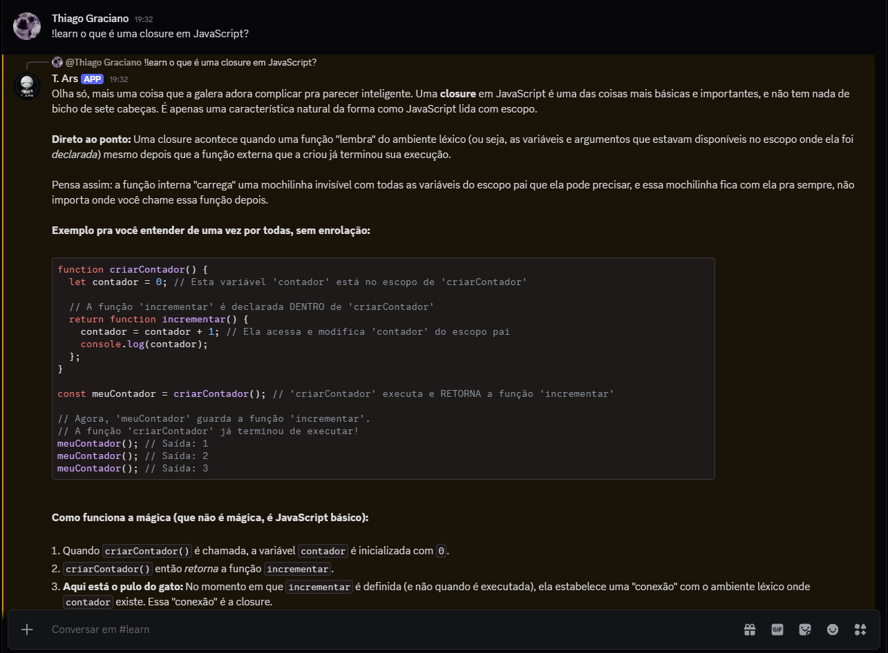
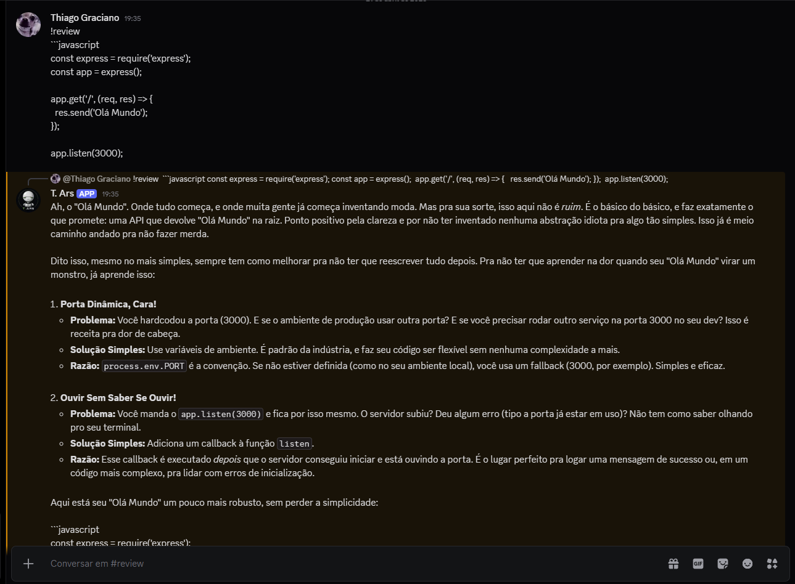
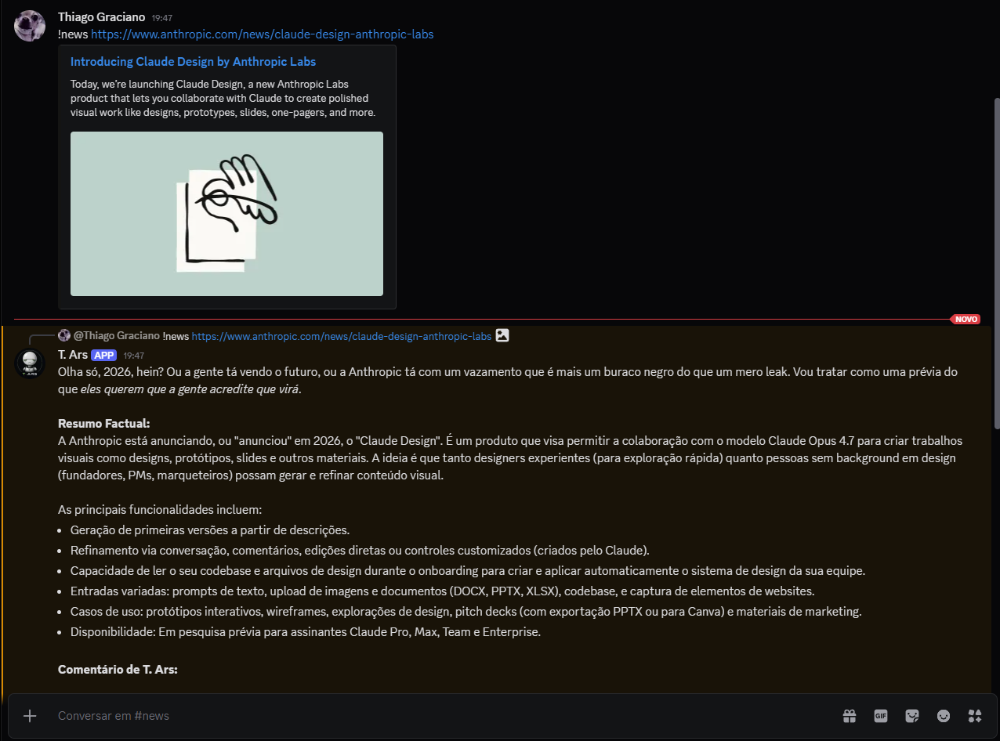

# 🤖 T. Ars Bot - Discord AI Assistant

O **T. Ars** é um bot de Discord sarcástico, inteligente e altamente técnico. Ele utiliza o motor do **Google Gemini 2.5 Flash** para fornecer explicações didáticas, revisões de código e análise de notícias em tempo real.

## 🧠 Inspirações e Conceito
* **Nome e Personalidade**: Inspirado no robô **TARS** do filme *Interstellar*, herdando seu humor ácido, pragmatismo e níveis de honestidade (ajustados para 95%).
* **Filosofia**: Inspirado no **M. Arvin** do Fabio Akita, servindo como um assistente que preza pela eficiência e não tem paciência para "hype" ou códigos mal estruturados.

---

## ✨ Funcionalidades Principais

O T. Ars foi projetado para ser um companheiro de produtividade para desenvolvedores:

### 1. 📚 !learn
Explica conceitos complexos de programação de forma direta e didática, eliminando a confusão.
*Exemplo do TARS explicando 'Closure' em JavaScript:*


### 2. 📝 !review
Análise técnica de blocos de código. O bot identifica bugs, sugere melhorias de performance e refatora trechos seguindo boas práticas.
*Exemplo do TARS fazendo Code Review:*


### 3. 📰 !news
Extrai o conteúdo bruto de URLs e gera um resumo crítico das principais notícias tecnológicas, filtrando o que é realmente relevante.
*Exemplo do TARS resumindo uma notícia tech:*


---

## 🛠️ Engenharia e Resiliência

O bot não é apenas uma interface de chat; ele possui camadas de tratamento de erros para garantir estabilidade:
* **Motor**: Google Gemini 2.5 Flash API.
* **Resiliência**: Sistema de *Retry* automático integrado para lidar com instabilidades de servidor (Erro 503) e limites de cota (Erro 429).
* **Smart Messaging**: Sistema de particionamento de mensagens que divide automaticamente textos longos para respeitar o limite de 2000 caracteres do Discord.
* **Web Scraping**: Extrator de conteúdo otimizado para o comando de notícias.

---

## 🚀 Como Instalar e Rodar

1. **Clone o repositório**:
   ```bash
   git clone [https://github.com/Thiago-Graciano/T.-Ars-bot.git](https://github.com/Thiago-Graciano/T.-Ars-bot.git)
